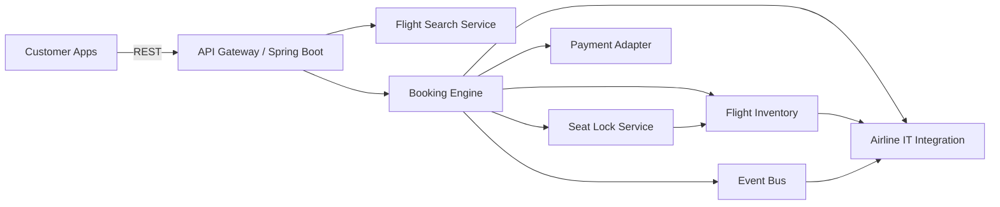

# Airline Seat Reservation System (Spring Boot)

## Architecture Overview



### Key Components
- **Flight Inventory**: Maintains flights, aircraft, and seat availability.
- **Booking Engine**: Validates inventory, manages bookings, and issues tickets.
- **Seat Lock Service**: Temporary holds to avoid overbooking.
- **Integration Layer**: Adapters for airline IT (PNR/ticketing) and payment providers.
- **Messaging**: Emits events for seat hold, booking confirmed, cancellation.

## Scenario Flow (Chosen: Book Seats for a Flight)

1. Customer searches flights by route.
2. Customer selects a flight and seats.
3. Booking Engine requests a seat lock.
4. Seat Lock Service marks seats as `LOCKED`.
5. Payment authorization is completed.
6. Booking Engine confirms seats and issues ticket.
7. Events are published to airline IT and downstream systems.

## Conceptual Data Model (5–8 entities)

- **Flight**: Flight ID, route, departure time.
- **Aircraft**: Aircraft ID, model.
- **Seat**: Seat ID, seat number, fare class, status.
- **FareClass**: Economy, Premium Economy, Business, First.
- **Passenger**: Passenger ID, name, email.
- **Booking**: Booking ID, flight ID, passenger, seats, status.
- **SeatLock**: Lock ID, flight ID, seats, expiration.

## Representative APIs

- `GET /api/flights/search?origin=JFK&destination=SFO`
- `GET /api/flights/{flightId}/seats?fareClass=ECONOMY`
- `GET /api/flights/{flightId}/fare-rules?fareClass=BUSINESS`
- `POST /api/bookings`
  ```json
  {
    "flightId": "FL-100",
    "passengerName": "Taylor Swift",
    "passengerEmail": "taylor@example.com",
    "seatIds": ["AE1", "AE2"]
  }
  ```
- `POST /api/bookings/{bookingId}/cancel`
- `POST /api/bookings/{bookingId}/reschedule`
  ```json
  {
    "newFlightId": "FL-200",
    "seatIds": ["BE1", "BE2"]
  }
  ```

## Key Architecture Decisions

- **Consistency Model**: Strong consistency for seat availability and booking confirmation (single-flight aggregate).
- **Database Choice**: Relational DB (e.g., PostgreSQL) for ACID guarantees, with a write-through cache for search.
- **Messaging**: Asynchronous event bus for ticketing updates and customer notifications.
- **Seat Lock Strategy**: Time-based locks (15 minutes) to reduce contention and allow graceful expiration.

## Pseudocode (Seat Lock)

```text
function lockSeats(flightId, seatIds):
  flight = getFlight(flightId)
  synchronized(flight):
    if any seat not AVAILABLE:
      raise conflict
    mark seats LOCKED
    save lock with expiration
  return lockId
```
